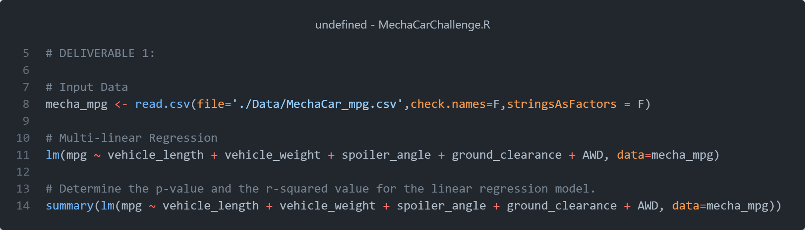
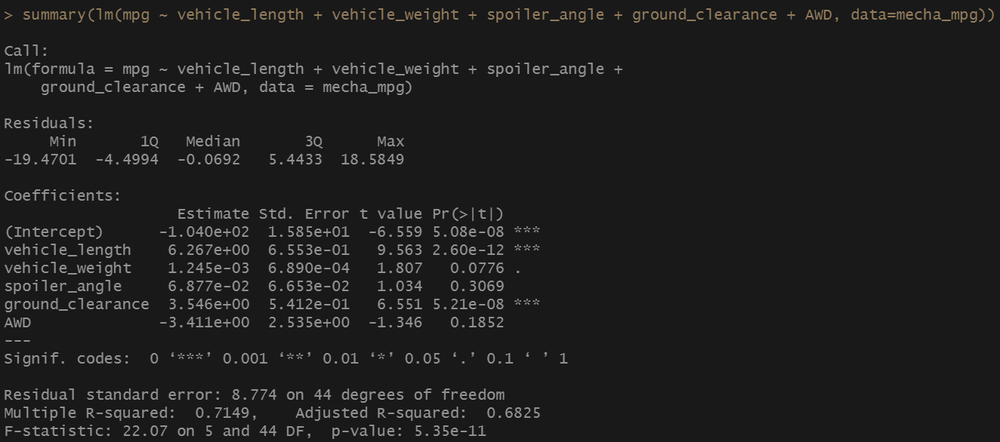
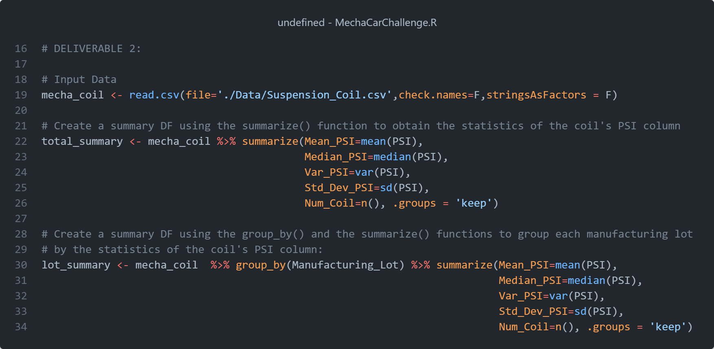
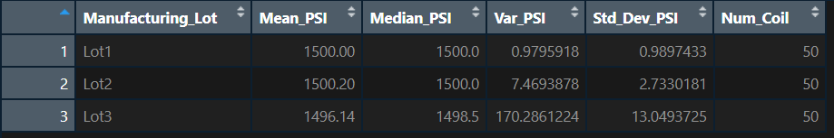
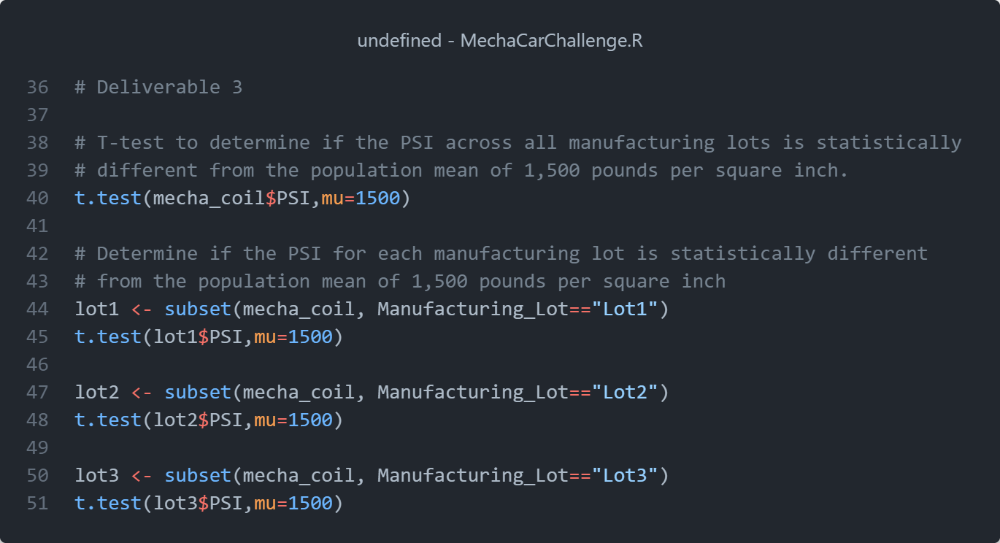
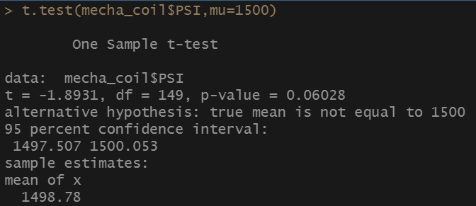
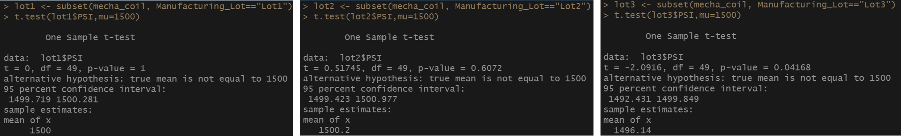

# MechaCar_Statistical_Analysis

## Overview

The objective of this module (**Module 15: Statistics and R**) is to conduct some statistical analysis to a collection of data from a new automotive prototype (MechaCar) of AutosRU's.

## Resources

### List of Applications Used

- _R v4.2.2_

### Input Datasets

- **[MechaCar MPG dataset](./Data/MechaCar_mpg.csv)**
- **[Suspension Coil Dataset](./Data/Suspension_Coil.csv)**

## Deliverables

The following is the list of the requested and the provided deliverable files for this modules's challenge.

### Requested Deliverables

- **Deliverable 1:** Linear Regression to Predict MPG
- **Deliverable 2:** Summary Statistics on Suspension Coils
- **Deliverable 3:** T-Test on Suspension Coils
- **Deliverable 4:** Design a Study Comparing the MechaCar to the Competition

### Provided Deliverables

- **[Full Challenge R Scipt](MechaCarChallenge.R)**
- **[Deliverable 1 Snippets](./Output/Deliverable1/)**
- **[Deliverable 2 Snippets](./Output/Deliverable2/)**
- **[Deliverable 3 Snippets](./Output/Deliverable3/)**
- **[Written Analysis](./README.md)**

## Results

The following libraries are required and were imported.

_Image01: Imported Libraries_.

### Deliverable1: Linear Regression to Predict MPG

The _MechaCar_mpg.csv_ dataset contains mpg test results for 50 prototype MechaCars. The MechaCar prototypes were produced using multiple design specifications to identify ideal vehicle performance. Multiple metrics, such as vehicle length, vehicle weight, spoiler angle, drivetrain, and ground clearance, were collected for each vehicle. Using R, design a linear model that predicts the mpg of MechaCar prototypes using several variables from the _MechaCar_mpg.csv_ file

_Image02: Deliverable 1 code_.

_Image03: Deliverable 1 output statistics_.

#### Further Analysis

- **Which variables/coefficients provided a non-random amount of variance to the mpg values in the dataset?**
  Answer: Due to its larger p-values, the vehicle length and ground clearance are likely to provide a non-random amount of variance to the MPG.
- **Is the slope of the linear model considered to be zero? Why or why not?**
  Answer: The slope is NOT zero, its value is 5.35e-11, value much smaller than the assumed significance level of 0.05. This is a strong indication that we can reject the null hypothesis.
- **Does this linear model predict mpg of MechaCar prototypes effectively? Why or why not?**
  Answer: The R-squared value indicates that approximately 70% of the MPG is explained by the linear regression, a fairly effective model.

## Deliverable 2: Summary Statistics on Suspension Coils

The _MechaCar Suspension_Coil.csv_ dataset contains the results from multiple production lots. In this dataset, the weight capacities of multiple suspension coils were tested to determine if the manufacturing process is consistent across production lots. Using R, create a summary statistics table to show:

1. The suspension coil’s PSI continuous variable across all manufacturing lots
2. The following PSI metrics for each lot: mean, median, variance, and standard deviation.

_Image04: Deliverable 2 code_.

_Image05: Deliverable 2 Summary Table_.

The summary table by lot contain results of testing the weight capacities of multiple suspension coils from multiple production lots to determine consistency.

_Image06: Deliverable 2 Summary Table by Lot_.

## Deliverable 3: T-Tests on Suspension Coils

Perform t-tests to determine if all manufacturing lots and each lot individually are statistically different from the population mean of 1,500 pounds per square inch.

_Image07: Deliverabl3 code_.

_Image08: Deliverabl3 T-Test_.

The obtained p-Value of 0.06028, is higher than the assumed significance level of 0.05, thus, there is NOT enough evidence to reject the null hypothesis.

Use the t.test() function and its subset() argument to determine if the PSI for each manufacturing lot is statistically different from the population mean of 1,500 pounds per square inch.

_Image08: Deliverabl3 T-Test by Lot_.

Given the P-values of each individual lot, for the first two lots, there is no evidence to reject the null hypothesis, that there is statistically no differences between the observed sample mean and the selected population mean of 1500 pounbds per square inch.
Lot 3 have a lower p-Value of ~0.04, which is slightly lower than the assumed significance level, indicating that we have enough evidence to reject the null hypothesis.

## Deliverabel 4: Study Design: MechaCar vs Competition

Design a statistical study to compare performance of the MechaCar vehicles against performance of vehicles from other manufacturers.

Address the following questions:

- **What metric or metrics are you going to test?**
  Answer: What is the size of the vehicles, compact, suv, pick-up, etc. What is the price range? what is the expected mileage per gallon? what are the vehicle emmisions metrics?
- **What is the null hypothesis or alternative hypothesis?**
  Answer: The null hypothesis states that there is no difference between the performance of the MechaCar vehicles against the vehicles from other manufacturers. The alternative hypothesis is that the MechaCar vehicles perform better in terms of reduced emmisions and fuel consumption when driving in the city.
- **What statistical test would you use to test the hypothesis? And why?**
  Answer: A correlation test between the models and the suggested variables in the alternative hypothesis. A linear regression to see what model fits the observations and to make predictions
- **What data is needed to run the statistical test?**
  Answer: The vehicle metrics taken from different vehicles from different manufacturers. More observations normally lead to more stable and accurate statistic results.
